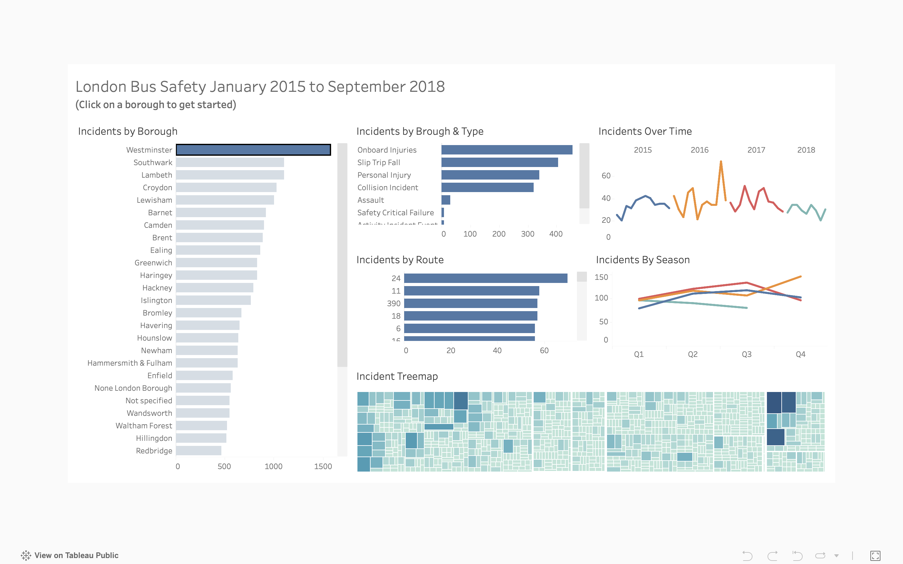

## 🚌 TFL Bus Safety (Makeover Monday)
An exploratory dashboard built using data from the [Makeover Monday](http://www.makeovermonday.co.uk/) project. The dataset focuses on bus safety incidents reported by Transport for London (TfL).

This project was completed as part of the [**Fundamentals of Visualization with Tableau**](https://www.coursera.org/learn/data-visualization-tableau) course offered by **University of California, Davis** on Coursera.

- **Data**: `TFL Bus Safety.xlsx`
- **Tool**: Tableau Public
- **Focus**: Visualizing accident trends, identifying common incident types, and highlighting safety patterns over time.
- **Status**: In progress
- **Original data source**: [Makeover Monday -2018/W51: London Bus Safety Performance](https://data.world/makeovermonday/2018w51)
> This project is part of my hands-on practice to improve skills in working with time-series data, building interactive dashboards, and presenting safety-related metrics clearly and effectively.
---

### 🔗 Live Dashboard   👉 [View on Tableau Public](https://public.tableau.com/app/profile/chih.chun.chan/viz/TFLBusSafety_17478717214220/DashboardforLondonBusSafety?publish=yes)  

---

### 👁️‍🗨️ Dashboard Preview

  

---

### 🧾 Project Summary

- **Dataset**: `TFL Bus Safety.xlsx` from Makeover Monday – Week 30, 2019  
- **Goal**: Analyze the frequency and types of bus-related incidents in London  
- **Key Visuals**:
  - Top boroughs by number of incidents
  - Incident types breakdown
  - Time series of monthly incident counts
  - Incidents by route and season
  - Treemap of detailed incidents

